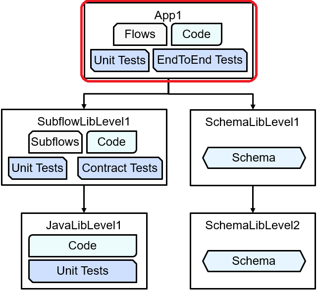
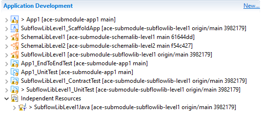

# ace-submodule-app1

ACE submodule application 1, relying on several submodules providing libraries.

This is the top level of a hierarchy of repositories:



Subflow library: https://github.com/trevor-dolby-at-ibm-com/ace-submodule-subflowlib-level1

Schema library 1: https://github.com/trevor-dolby-at-ibm-com/ace-submodule-schemalib-level1

Originally created for a [blog post](https://community.ibm.com/community/user/integration/blogs/trevor-dolby/2023/04/03/automated-multi-repo-app-connect-enterprise-ace-ba).

## Tests

This repo contains two types of tests, ensuring both that the code in the app is
working as expected and also that the overall solution works when new versions
of the libraries are pulled in

#### Unit tests

Tests the main Compute node in one of the flows to make sure it is adding the
correct XML; tests could be extended to other nodes and flows to enhance this repo.

#### End-to-end tests

Tests the HTTP-based flow to ensure that is creates the correct combination 
of body and header data, validating the behavior of the libraries as well as
the application itself.

## Local build

Clone and build as follows:
```
git clone --recursive git@github.com:trevor-dolby-at-ibm-com/ace-submodule-app1.git
cd ace-submodule-app1
./build-and-ut.sh
./build-and-run-end-to-end-tests.sh
```

Update submodules with `git submodule update --remote --merge --recursive`

## Toolkit

When importing this repo into the toolkit, the "Clone submodules" and "Import all
existing Eclipse projects after clone finishes" boxes should be selected:


After that has completed, all the projects should appear as usual, with the test
projects able to run successfully:



## Jenkins

Deploys to a local integration node from a [Jenkins pipeline](README-jenkins.md).

## GitHub Action

Runs the build and test scripts automatically on pull requests.
